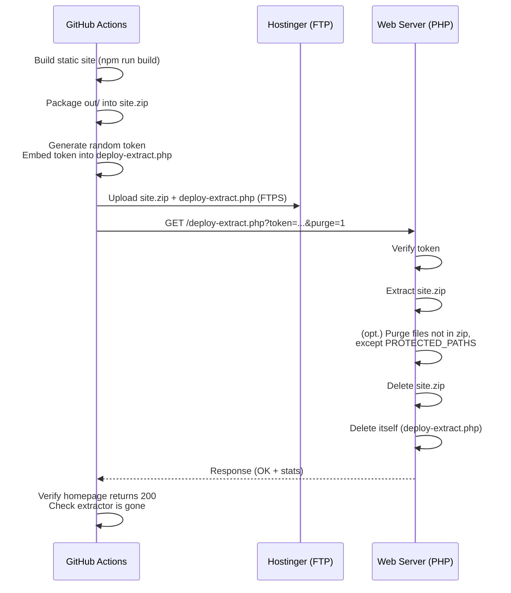

# Deployment System for ProDesignity Static Site

This document describes the automated deployment pipeline that builds the static site and deploys it to Hostinger (or any compatible shared hosting) via FTPS. The system is designed to be secure, idempotent, and self-cleaning.

## Table of Contents

- [Overview](#overview)
- [Deployment Flow](#deployment-flow)
- [Files](#files)
- [Setup and Configuration](#setup-and-configuration)
- [Security Considerations](#security-considerations)
- [Running the Deployment](#running-the-deployment)
- [Troubleshooting](#troubleshooting)
- [Maintenance and Updates](#maintenance-and-updates)

---

## Overview

The deployment is triggered on every push to the `main` branch (or manually via `workflow_dispatch`). It:

1. Builds the static site using Node.js (`npm run build`).
2. Packages the built output (`out/`) into `site.zip`.
3. Injects a one‑time authentication token into a PHP extraction script.
4. Uploads both `site.zip` and the extraction script to the server via FTPS.
5. Calls the extraction script over HTTPS with the token; the script unzips the archive, optionally purges stale files, and then **deletes both the zip and itself**.
6. Verifies that the site is live and that the extractor is gone.

This approach avoids leaving a persistent, publicly reachable PHP script that could be abused for remote code execution.

---

## Deployment Flow



---

## Files

| File                           | Location           | Purpose                                                                                                         |
| ------------------------------ | ------------------ | --------------------------------------------------------------------------------------------------------------- |
| `deploy/deploy-extract.php`    | Repository         | The server‑side extraction script. It is copied, token‑injected, and uploaded to the server during each deploy. |
| `.github/workflows/deploy.yml` | Repository         | GitHub Actions workflow that orchestrates the entire build‑and‑deploy process.                                  |
| `site.zip`                     | Server (temporary) | Created by the workflow and uploaded to the root of the server; deleted by the extraction script.               |

---

## Setup and Configuration

### Prerequisites

- **GitHub repository** with the static site source code (e.g., Next.js, Astro, or any framework that outputs a static directory).
- **Hostinger** (or any PHP + FTP server) with:
    - PHP 8.1 or later.
    - `zip` extension enabled (for `ZipArchive`).
    - Write permissions for the document root.
- **FTP/SFTP credentials** with write access to the server root.

### GitHub Secrets & Variables

Configure the following in your repository settings (`Settings → Secrets and variables → Actions`):

| Name           | Type     | Description                                                                                                    |
| -------------- | -------- | -------------------------------------------------------------------------------------------------------------- |
| `FTP_SERVER`   | Secret   | FTP server hostname (e.g., `ftp.yourdomain.com`)                                                               |
| `FTP_USERNAME` | Secret   | FTP username                                                                                                   |
| `FTP_PASSWORD` | Secret   | FTP password                                                                                                   |
| `SITE_URL`     | Variable | The public URL of the site, e.g., `https://prodesignity.com`. Used for verification and calling the extractor. |

> **Note:** The `state-name` in the FTP action uses `github.run_id` to avoid collisions and ensure the zip is always uploaded even if a previous run’s state file still exists.

### Server Setup

- Ensure the document root (`/public_html` or equivalent) is writable by the PHP process.
- The `zip` extension must be enabled. Check via `php -m | grep zip` or a `phpinfo()` page.
- No other server‑side configuration is required; the extraction script handles everything.

---

## Security Considerations

### One‑Time Token

- A fresh, cryptographically secure token (24 hex bytes) is generated per workflow run.
- The token is embedded into `deploy-extract.php` via `sed`, replacing `__DEPLOY_TOKEN__`.
- The token is **never** stored in the repository or logs (masked via `::add-mask::`).
- The script compares tokens using `hash_equals()` to prevent timing attacks.

### Self‑Destruction

- After successful extraction, the script deletes `site.zip` and **its own file** (`deploy-extract.php`).
- This eliminates a persistent entry point that could be exploited if discovered.
- If self‑deletion fails (e.g., permission issues), a warning is shown; you should manually remove the file.

### Protected Paths

Even when `purge=1` is used, the following server files/directories are **never** deleted:

```
.htaccess
.well-known
cgi-bin
php.ini
.user.ini
error_log
api/config.php
api/bookings.log
site.zip
```

This ensures that important configuration, redirects, API credentials, and mail routing are preserved across deploys.

### Path Traversal Protection

The extraction script validates every entry in the zip archive and rejects any containing `../` or leading `/` to prevent writing outside the document root.

### HTTPS Enforcement

The workflow calls the extractor over HTTPS (using `SITE_URL`). Ensure your server enforces HTTPS to keep the token transmission secure.

---

## Running the Deployment

### Automatic Deployment

Pushes to the `main` branch will automatically trigger the `build-and-deploy` job. No manual action is needed.

### Manual Trigger

Go to the repository’s **Actions** tab, select the **Deploy Static Site to Hostinger** workflow, and click **Run workflow**. You can optionally choose the branch (usually `main`).

### What to Expect

- The GitHub Actions run will complete in a few minutes.
- On success, the output logs will show:
    ```
    OK
    extracted: <number> files
    purged: <number> paths
    self‑removed: yes
    ```
- The site will be live with the latest build.
- The verification step will check that the homepage returns HTTP 200 and that the extractor is gone (returns 404).

---

## Troubleshooting

| Symptom                                                  | Possible Cause                                                                                                                              | Solution                                                                                                  |
| -------------------------------------------------------- | ------------------------------------------------------------------------------------------------------------------------------------------- | --------------------------------------------------------------------------------------------------------- |
| `FAIL: deploy token was not substituted.`                | The `sed` replacement failed.                                                                                                               | Check that `deploy/deploy-extract.php` exists and contains the exact placeholder `__DEPLOY_TOKEN__`.      |
| `FAIL: bad token.`                                       | The token in the URL does not match the embedded one.                                                                                       | Token is ephemeral; ensure the script is called immediately after upload, and that `SITE_URL` is correct. |
| `FAIL: site.zip not found.`                              | FTP upload did not complete or file was placed elsewhere.                                                                                   | Verify FTP credentials and that `server-dir: ./` targets the document root.                               |
| `FAIL: extraction failed — check directory permissions.` | The web server cannot write to the document root.                                                                                           | Ensure write permissions (`chmod 755` or `775`) for the target directory.                                 |
| `FAIL: the PHP zip extension is not enabled.`            | `ZipArchive` missing.                                                                                                                       | Enable `zip` in `php.ini` or contact your hosting provider.                                               |
| Extractor remains after deploy (`HTTP 200`).             | Self‑deletion failed due to permissions.                                                                                                    | Manually delete `deploy-extract.php` via FTP or SSH.                                                      |
| Purge removed too many files.                            | You added a custom path to `PROTECTED_PATHS` but it wasn't recognised.                                                                      | Review the list in `deploy-extract.php` and adjust as needed.                                             |
| `state-name` collision causing zip not uploaded.         | The `state-name` uses `github.run_id`, which is unique; this should not happen. If it does, delete the `.deploy-state-*.json` file via FTP. |                                                                                                           |

---

## Maintenance and Updates

### Modifying Protected Paths

If you have additional server‑only files that should never be deleted, edit the `PROTECTED_PATHS` constant in `deploy/deploy-extract.php` and commit the change. The workflow will pick up the new version automatically.

### Upgrading the Extraction Script

- The script is version‑controlled in the repository.
- Any changes to the script (e.g., better logging, additional safety checks) will be deployed on the next workflow run.
- Always test changes in a staging environment before pushing to `main`.

### Manual Recovery

If a deployment fails and leaves `deploy-extract.php` or `site.zip` on the server, you can safely delete them via FTP. The next successful deploy will clean up any remaining files (if purge is enabled).

---

## Final Notes

- The deployment system is designed to be **stateless** and **idempotent**.
- It leverages standard PHP features and does not require Composer or external dependencies on the server.
- For any questions or improvements, refer to the code comments in `deploy-extract.php` and `deploy.yml`.
